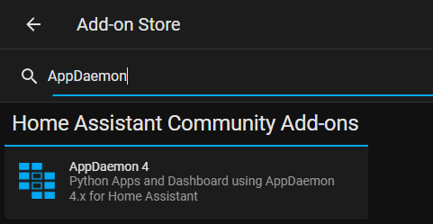
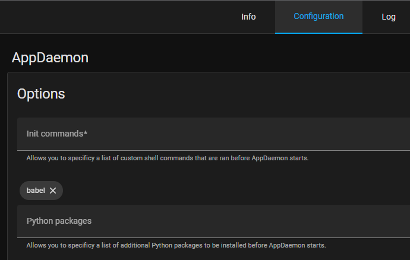

# Setup Home Assistant

## Installing AppDaemon

The backend application for HomeAssistant is written in a python for [AppDaemon](https://github.com/AppDaemon/appdaemon). 
This means it requires a working and running installation of AppDaemon.

The easiest way to install it is through Home Assistant's Supervisor Add-on Store, it will be automaticly connected to your Home Assistant Instance.



<details>
<summary>Instructions for users of HomeAssistant Core installed through docker containers.</summary>

In case you have a homeassistant setup using docker cotainers and the Add-on Store is not available to you, you can follow this guide for setting up AppDaemon. https://appdaemon.readthedocs.io/en/latest/DOCKER_TUTORIAL.html
Please also pay attention to the correct volume mount for the conf folder of appdaemon, that has to point to the appdaemon folder within your homeassistant config folder.

Here is an example docker compose file for homeassistant and appdaemon:

```
version: "3.5"
services:
  homeassistant:
    image: ghcr.io/home-assistant/home-assistant:stable
    container_name: homeassistant
    network_mode: host
    volumes:
      - ./docker-data/homeassistant/:/config
      - /etc/localtime:/etc/localtime:ro
    environment:
      - TZ=Europe/Berlin
    privileged: true
    restart: unless-stopped
	
  appdaemon:
    container_name: appdaemon
    image: acockburn/appdaemon:4.2.3
    environment:
      - HA_URL=http://your-homeassistant-url:8123
      - TOKEN="xxxxxx"
    volumes:
      - /etc/localtime:/etc/localtime:ro
      - ./docker-data/homeassistant/appdaemon:/conf
    depends_on:
      - homeassistant
    restart: unless-stopped
```
</details>

### Add babel package to AppDaemon Container (Optional)

For localisation (date in your local language) you need to add the python package babel to your AppDaemon Installation.




## Installing Studio Code Server

You will need a way to edit the `apps.yaml` config file in the Appdaemon folder. 
Install Studio Code Server from Home Assistant's Supervisor Add-on Store to easily edit configuration Files on your HomeAssistant Instance.


## Installing HomeAssistant Community Store

HACS is the Home Assistant Community Store and allows for community integrations and
automations to be updated easily from the Home Assistant web user interface.
You will be notified of updates, and they can be installed by a click on a button.

## Installing Lovelace AppDaemon Backend Application

To install Lovelace UI Backend App with HACS, you will need to make sure that you enabled
AppDaemon automations in HACS, as these are not enabled by default:

1. Click on `Configuration` on the left menu bar in Home Assistant Web UI
2. Select `Devices & Services`
3. Select `Integrations`
4. Find `HACS` and click on `Configure`
5. In the window that opens, make sure that `Enable AppDaemon apps discovery & tracking`
   is checked, or check it and click `Submit`
6. If you just enabled this (or just installed HACS), you might have to wait a few minutes
   as all repositories are being fetched; you might hit a GitHub rate limit, which might
   then require you to wait a few hours for HACS to be fully configured. In this case,
   you won't be able to proceed to the next steps until HACS is ready.

Now, to install NSPanel Lovelace UI Backend with HACS, follow these steps:

1. Click on `HACS` on the left menu bar in Home Assistant Web UI
2. Click on `Automations` in the right panel
3. Click on `Explore & download repositories` in the bottom right corner
4. Search for `NSPanel`, and click on `NSPanel Lovelace UI Backend` in the list that appears
5. In the bottom right corner of the panel that appears, click on
   `Download this repository with HACS`
6. A confirmation panel will appear, click on `Download`, and wait for HACS to
   proceed with the download
7. The Backend Application is now installed, and HACS will inform you when updates are available
